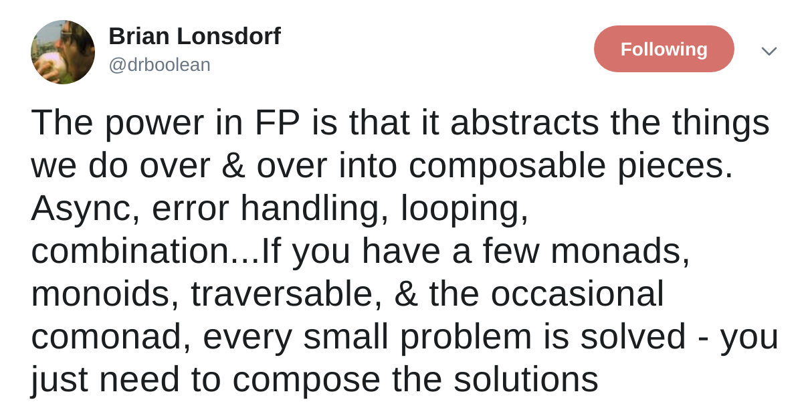

# @color[GoldenRod](Why)
# go functional?

---
## before we jump to that...

---
## What should we @color[IndianRed](expect)
## from a fp workshop?

---
## It's a bit like 
## @color[GoldenRod](learning) to program @color[IndianRed](again)

---
## @color[IndianRed](do not judge)
## what you will see 
## @color[GoldenRod](with the eyes of)
## what you know today

---
## take this workashop as
## a @color[GoldenRod](place) and @color[GoldenRod](time)
## to @color[IndianRed](experiment) and @color[IndianRed](fail)

---
# @color[GoldenRod](Why)
# functional programming?

---
## @color[GoldenRod](composition)

---


---
# why @color[GoldenRod](composition) is so @color[IndianRed](important)?

---
> How do we solve problems? 
> We decompose bigger problems into smaller problems. 
> If the smaller problems are still too big, we decompose them further, and so on.

---
> Finally, we write code that solves all the small problems.

---
> And then comes the essence of programming:
> we compose those pieces of code to create solutions to larger problems.

---
> Decomposition wouldn’t make sense if we weren’t able to put the pieces back together. - Bartosz Milewski

---
## True Story
### In Complex System we dedicate 
### @color[IndianRed](a significant portion)
### of code and effort 
### @color[GoldenRod](to compose) pieces togheter

---
## @color[GoldenRod](who) is the number one @color[IndianRed](enemy) of composition?

---
## side-effects

---
## it can't compose
```scala
val toS : Int => String = n => {
  appendAll("log.txt", "some content")
  n.toString
}
```

---
## it can't compose
```scala
val list = collection.mutable.ListBuffer[Int]()

val toS : Int => String = n => {
  list += n
  if (list.size < 42) n.toString
  else "Yo!"
}
```

---
## Side-effects are a @color[IndianRed](complexity source)
- hide inputs and outputs
- destroy testability
- destroy composability

---
## In other words
FP is about @color[IndianRed](eliminating) or @color[GoldenRod](controlling) side-effects

---
## How?
see “function” as the @color[IndianRed](mathematical) one:
- @color[GoldenRod](Total): it must yield a value for every possible input
- @color[GoldenRod](Deterministic): it must yield the same value for the same input
- @color[GoldenRod](Pure): it’s only effect must be the computation of its return value

---
## We earn back
all functions become @color[GoldenRod](referentially transparent)

---
## Referential Transparency
An @color[GoldenRod](expression can be replaced) with<br />
its corresponding value @color[IndianRed](without changing)<br >
the program's behavior

---
## Referential Transparency
it means these two programs are @color[GoldenRod](equivalent)
```scala
val y = foo(x)
val z = y + y
```

```scala
val z = foo(x) + foo(x)
```

---
## RT Benefits
functions get an @color[IndianRed](extraordinary quality) boost:
- easier to @color[GoldenRod](reason)
- easier to @color[GoldenRod](compose)
- easier to @color[GoldenRod](refactor)
- easier to @color[GoldenRod](test)

---
## @color[GoldenRod](pssss...)
### mathematicians do 
### @color[IndianRed](refactor their "code")
### since long before us
`\[
x(y + z) = (xy) + (xz) 
\]`